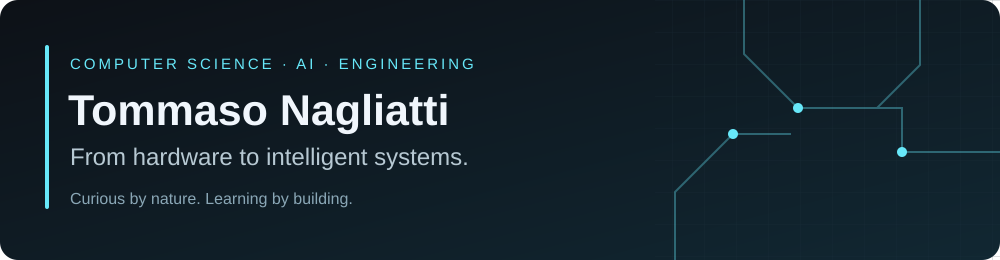
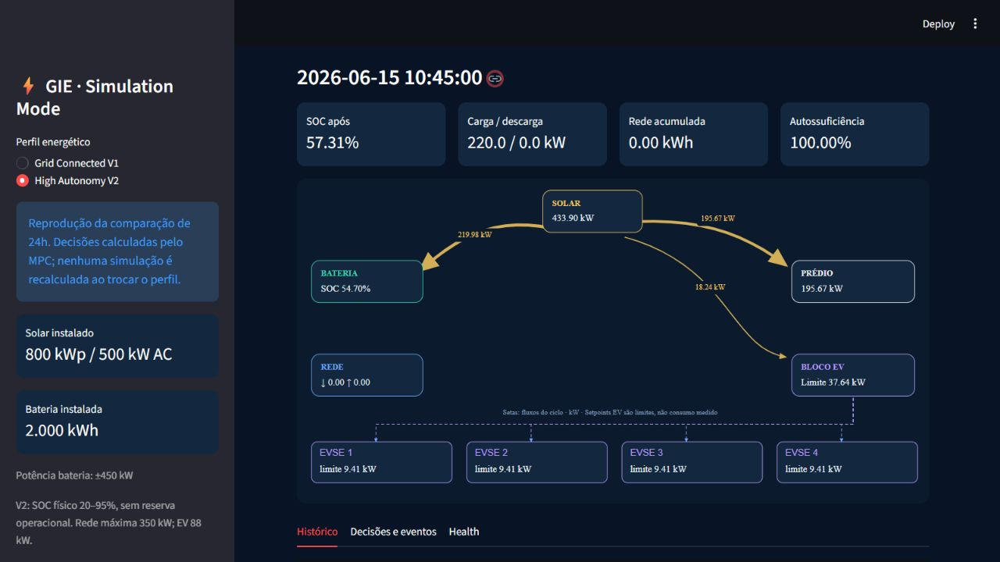
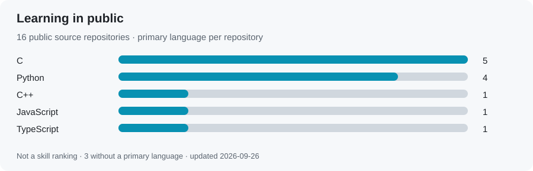

  

# Hi, I'm Tommaso.

**Computer Science student at FIAP · AI, software & intelligent systems**

I started with Mechatronics, electronics and robotics. Today, I'm bringing that hands-on background into software, data and AI—building systems that connect code to the physical world.

[Explore my work](#featured-work) · [What I'm learning](#current-focus) · [Let's connect](https://www.linkedin.com/in/tommaso-nagliatti/)

## About me

I'm studying Computer Science at **FIAP**, after completing a Mechatronics technical program integrated with high school at **IFSP**. I enjoy understanding how a system works end to end: the sensor, the data, the decision and the interface.

My interests meet at **software + hardware + artificial intelligence**, with a growing focus on energy, automation and practical, explainable systems. I'm still learning—and I like turning that learning into something I can test and demonstrate.

## Featured work

### GIE · Intelligent Energy Management
**AI + software + energy**

How should a building share available energy between its own demand and EV charging?

[GIE](https://github.com/TommasoNagliatti/GIE) is my energy-management prototype combining building and EV demand forecasts, solar forecasting, battery storage, MPC optimization and fair allocation across four chargers.

**ML forecasts demand. MPC makes the energy decisions. The Load Balancer distributes EV power.**

It includes a 12-hour forecasting horizon, traceable decisions and an accelerated local dashboard. The scenarios are synthetic; physical equipment integration is a future step.

[Explore GIE →](https://github.com/TommasoNagliatti/GIE)

**Related team project — EMPS / GoodWe Challenge**

For FIAP's EV Challenge, our team explored charging-session monitoring, app-to-dashboard communication and simulated prepaid payments. This broader prototype complements the energy problem; the GIE repository remains independent of billing.

[EMPS project overview](https://github.com/TommasoNagliatti/GitHub-de-Python) · [EMPS app prototype](https://github.com/TommasoNagliatti/Emps-APP)

### More things I've built

- **[ORION Control AI](https://github.com/TommasoNagliatti/orion-control-ai)** — a team academic project combining simulated mission telemetry, rule-based alerts and OpenAI-assisted diagnostics in a Python notebook.
- **[Vehicle Charge Simulator](https://github.com/TommasoNagliatti/vehicle-charge-simulator)** — a C program simulating charging time, energy consumption, cost and battery level.

## Working with & learning

- **Programming:** Python first; C, C++, R and SQL.
- **AI & data:** Machine Learning, Pandas, NumPy; exploring LLMs, LangChain, Ollama, OpenAI API, Gemini and RAG.
- **Backend & databases:** Flask, REST APIs, MySQL, PyMySQL and SQLAlchemy.
- **Hardware:** electronics, sensors, RFID, IoT, robotics and automation.
- **Everyday tools:** Git, GitHub, VS Code, Jupyter, RStudio and PowerShell; some Node/npm tooling.

## Current focus

- Building stronger foundations in Python, statistics and Machine Learning.
- Exploring document retrieval, RAG and local language models.
- Connecting forecasts to constrained, observable decisions.
- Improving APIs, data models and clear technical communication.

## Public work, in perspective

<!-- ACTIVITY:START -->
<picture>
  <source media="(max-width: 600px) and (prefers-color-scheme: dark)" srcset="./assets/generated/activity-mobile-dark.svg" />
  <source media="(max-width: 600px)" srcset="./assets/generated/activity-mobile.svg" />
  <source media="(prefers-color-scheme: dark)" srcset="./assets/generated/activity-dark.svg" />
  <source media="(prefers-color-scheme: light)" srcset="./assets/generated/activity.svg" />
  
</picture>
<!-- ACTIVITY:END -->

A small snapshot of my public repositories—not a proficiency score. Updated by the profile workflow.

## Background & milestones

- **Computer Science — FIAP** · currently studying.
- **Mechatronics Technician — IFSP** · electronics, automation and robotics.
- **1st place — Line Follower Robot Competition.**
- **Technical capstone:** IoT and RFID access-control project.
- **HarvardX — Data Science: R Basics** · completed.

I also bring a visual side to technical work. Through **Northa**, I've worked with branding, content, motion design and digital presence—including Adobe tools, Premiere and Shopify. I care about making useful systems understandable and well presented.

## Let's connect

[LinkedIn](https://www.linkedin.com/in/tommaso-nagliatti/) · [Public repositories](https://github.com/TommasoNagliatti?tab=repositories)

Always interested in learning with people building thoughtful applications of AI, software and engineering.

<!-- SNAKE:START -->
<picture>
  <source media="(prefers-color-scheme: dark)" srcset="./assets/generated/snake-dark.svg" />
  <source media="(prefers-color-scheme: light)" srcset="./assets/generated/snake.svg" />
  
</picture>
<!-- SNAKE:END -->
